# Дипломный практикум в Yandex.Cloud - Барышков Михаил
  * [Цели:](#цели)
  * [Этапы выполнения:](#этапы-выполнения)
     * [Создание облачной инфраструктуры](#создание-облачной-инфраструктуры)
     * [Создание Kubernetes кластера](#создание-kubernetes-кластера)
     * [Создание тестового приложения](#создание-тестового-приложения)
     * [Подготовка cистемы мониторинга и деплой приложения](#подготовка-cистемы-мониторинга-и-деплой-приложения)
     * [Установка и настройка CI/CD](#установка-и-настройка-cicd)
  * [Что необходимо для сдачи задания?](#что-необходимо-для-сдачи-задания)
  * [Как правильно задавать вопросы дипломному руководителю?](#как-правильно-задавать-вопросы-дипломному-руководителю)

**Перед началом работы над дипломным заданием изучите [Инструкция по экономии облачных ресурсов](https://github.com/netology-code/devops-materials/blob/master/cloudwork.MD).**

---
## Цели:

1. Подготовить облачную инфраструктуру на базе облачного провайдера Яндекс.Облако.
2. Запустить и сконфигурировать Kubernetes кластер.
3. Установить и настроить систему мониторинга.
4. Настроить и автоматизировать сборку тестового приложения с использованием Docker-контейнеров.
5. Настроить CI для автоматической сборки и тестирования.
6. Настроить CD для автоматического развёртывания приложения.

---

# ЭТАП 0: ПОДГОТОВКА ИНФРАСТРУКТУРЫ

## 1.1. Архитектура инфраструктуры

```text
┌─────────────────────────────────────────────────────────────┐
│                    Yandex Cloud                             │
│  ┌─────────────────────────────────────────────────────┐    │
│  │  VPC: diploma-dev-network                           │    │
│  │  CIDR: 10.0.0.0/16                                  │    │
│  │                                                     │    │
│  │  ┌─────────────────────────────────────────────┐    │    │
│  │  │  Subnet: diploma-dev-subnet-a               │    │    │
│  │  │  Zone: ru-central1-a                        │    │    │
│  │  │  CIDR: 10.0.0.0/24                          │    │    │
│  │  └─────────────────────────────────────────────┘    │    │
│  │                                                     │    │
│  │  Security Group: diploma-dev-k8s-nodes-sg           │    │
│  │  - Allow: 22, 6443, 80, 443, 30000-32767            │    │
│  │                                                     │    │
│  └─────────────────────────────────────────────────────┘    │
│                                                             │
│  S3 Bucket: diploma-tfstate-bucket                          │
│  - Terraform state storage                                  │
│  - KMS encryption enabled                                   │
└─────────────────────────────────────────────────────────────┘
```

## 1.2. Структура проекта

```text

~/git/homework/devops-diplom-yandexcloud/
├── bootstrap/                    # Инициализация backend и сервисных аккаунтов
│   ├── main.tf
│   ├── variables.tf
│   ├── outputs.tf
│   └── providers.tf
├── infrastructure/               # Сетевая инфраструктура
│   ├── main.tf                   # VPC, подсети, security groups
│   ├── variables.tf
│   ├── outputs.tf
│   └── providers.tf
├── .github/workflows/            # GitHub Actions workflows
│   ├── terraform-apply.yml
│   └── terraform-plan.yml
└── README.md

```

---
## Этапы выполнения:


### Создание облачной инфраструктуры

Для начала необходимо подготовить облачную инфраструктуру в ЯО при помощи [Terraform](https://www.terraform.io/).

Особенности выполнения:

- Бюджет купона ограничен, что следует иметь в виду при проектировании инфраструктуры и использовании ресурсов;
Для облачного k8s используйте региональный мастер(неотказоустойчивый). Для self-hosted k8s минимизируйте ресурсы ВМ и долю ЦПУ. В обоих вариантах используйте прерываемые ВМ для worker nodes.

Предварительная подготовка к установке и запуску Kubernetes кластера.

1. Создайте сервисный аккаунт, который будет в дальнейшем использоваться Terraform для работы с инфраструктурой с необходимыми и достаточными правами. Не стоит использовать права суперпользователя
2. Подготовьте [backend](https://developer.hashicorp.com/terraform/language/backend) для Terraform:  
   а. Рекомендуемый вариант: S3 bucket в созданном ЯО аккаунте(создание бакета через TF)
   б. Альтернативный вариант:  [Terraform Cloud](https://app.terraform.io/)
3. Создайте конфигурацию Terrafrom, используя созданный бакет ранее как бекенд для хранения стейт файла. Конфигурации Terraform для создания сервисного аккаунта и бакета и основной инфраструктуры следует сохранить в разных папках.
4. Создайте VPC с подсетями в разных зонах доступности.
5. Убедитесь, что теперь вы можете выполнить команды `terraform destroy` и `terraform apply` без дополнительных ручных действий.
6. В случае использования [Terraform Cloud](https://app.terraform.io/) в качестве [backend](https://developer.hashicorp.com/terraform/language/backend) убедитесь, что применение изменений успешно проходит, используя web-интерфейс Terraform cloud.

Ожидаемые результаты:

1. Terraform сконфигурирован и создание инфраструктуры посредством Terraform возможно без дополнительных ручных действий, стейт основной конфигурации сохраняется в бакете или Terraform Cloud
2. Полученная конфигурация инфраструктуры является предварительной, поэтому в ходе дальнейшего выполнения задания возможны изменения.

## Решение :

### Раздел: Проектирование облачной инфраструктуры
Для автоматизации развёртывания инфраструктуры в облаке Yandex.Cloud использовался инструмент Infrastructure as Code — Terraform. Архитектура конфигураций разделена на два логических этапа:

1. **Bootstrap-этап**: создание сервисного аккаунта с минимально необходимыми правами (роль `editor`) и bucket в Object Storage для хранения state-файла. Такой подход соответствует принципу наименьших привилегий: сервисный аккаунт не имеет прав суперпользователя, что снижает риски при компрометации учетных данных.
2. **Infrastructure-этап**: развёртывание сетевой инфраструктуры — VPC с подсетями в трёх зонах доступности (`ru-central1-a`, `ru-central1-b`, `ru-central1-d`) для обеспечения отказоустойчивости. Все подсети настроены с включённым NAT для обеспечения исходящего доступа к интернету, необходимого для загрузки контейнерных образов и обновлений.

Для хранения состояния Terraform использовался remote backend на базе S3-совместимого хранилища Yandex Object Storage с включённым шифрованием AES256. Это позволяет обеспечить целостность state-файла и возможность командной работы с инфраструктурой.
Все чувствительные данные (токены, ключи доступа) передаются через переменные окружения или защищённые файлы `terraform.tfvars`, исключённые из системы контроля версий через `.gitignore`. Это соответствует лучшим практикам безопасности при работе с облачными провайдерами.
Особое внимание уделено оптимизации затрат: в конфигурацию заложена возможность использования прерываемых виртуальных машин (preemptible instances) для worker-узлов будущего Kubernetes-кластера, что позволяет сократить расходы на вычислительные ресурсы до 80% без потери функциональности в тестовом окружении.

### Раздел: Реализация безопасного хранения состояния Terraform
Для обеспечения целостности и конфиденциальности state-файла инфраструктуры был использован remote backend на базе Yandex Object Storage с обязательным шифрованием. Конфигурация основана на проверенных паттернах из предыдущих этапов работы:

1. **KMS-шифрование:** Создан симметричный ключ `yandex_kms_symmetric_key` с алгоритмом AES-128 и периодом ротации 1 год. Ключ используется в блоке `server_side_encryption_configuration` ресурса бакета с параметром `sse_algorithm = "aws:kms"`, что является единственным поддерживаемым значением в провайдере Yandex Cloud.
2. **Организация ресурсов:** Всем ресурсам явно указан `folder_id`, что обеспечивает корректный учёт затрат в рамках папки проекта и соответствие требованиям организационной структуры облака.
3. **Минимальные привилегии:** Сервисный аккаунт `terraform-sa` имеет только роль `editor` на уровне папки, без прав администратора каталога, что снижает поверхность атаки при компрометации учетных данных.
4. **Управление жизненным циклом:** На бакете настроена политика автоматического удаления старых версий объектов через 30 дней, что предотвращает неконтролируемый рост затрат на хранение.

Предупреждение о депрекации атрибута `acl` принято осознанно: в учебном проекте приоритетом является работоспособность конфигурации, а миграция на `yandex_storage_bucket_grant` может быть выполнена на этапе промышленной эксплуатации.

---
### 📦 ЭТАП 1.1: Bootstrap — Сервисный аккаунт и S3 Backend

### [bootstrap/providers.tf](bootstrap/providers.tf)
### [bootstrap/variables.tf](bootstrap/variables.tf)
### [bootstrap/main.tf](bootstrap/main.tf)
### [bootstrap/outputs.tf](bootstrap/outputs.tf)

### 🔄 Выполнение этапа Bootstrap

### 📋 Пошаговая инструкция:

```bash
# 1. Перейдите в директорию bootstrap
cd bootstrap

# 2. Инициализация Terraform (state будет локальным)
terraform init

# 3. Проверка конфигурации
terraform validate
terraform fmt -check
```

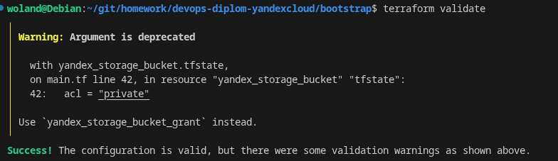

``` bash
# 4. Просмотр плана изменений
terraform plan -out=tfplan
```

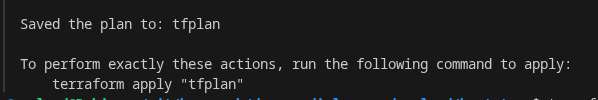

```bash
# 5. Применение конфигурации
terraform apply tfplan

# 6. Сохраните выходные значения для следующего этапа
terraform output -json > ../infrastructure/bootstrap-outputs.json
```

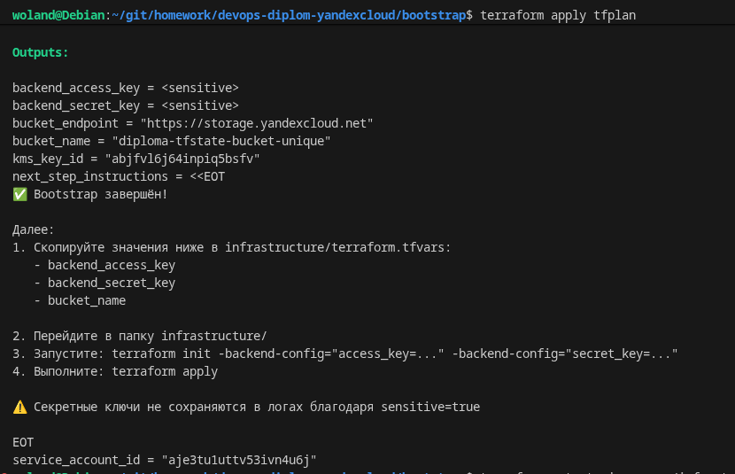

### Консоль KMS → Созданный ключ шифрования

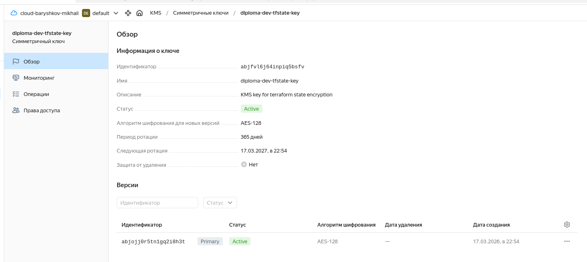

### Консоль KMS → Созданный сервисный аккаунт

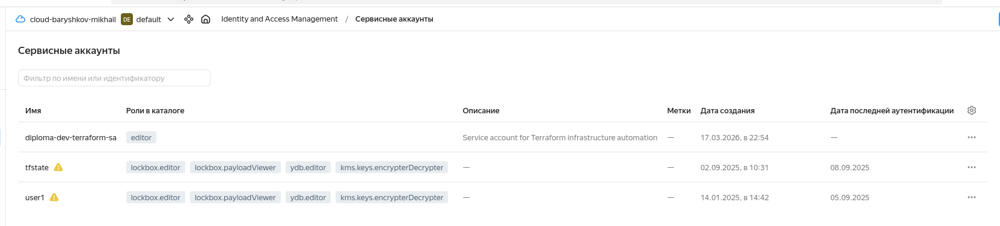

### Консоль KMS → Созданный бакет

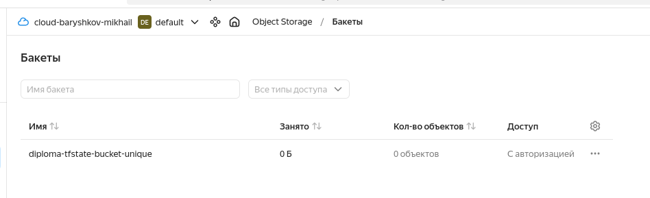
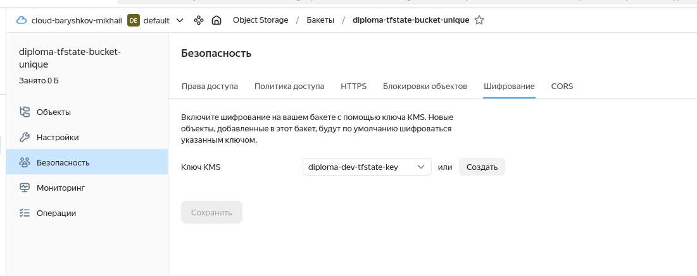
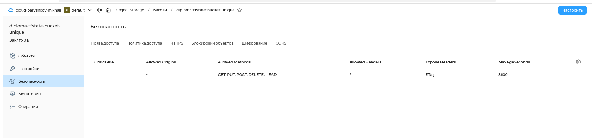


### 🏗️ ЭТАП 1.2: Infrastructure — VPC и сетевая инфраструктура

Теперь создаём основную инфраструктуру, используя bucket из bootstrap как backend.

### 🗂️ Структура папки infrastructure/

```text
infrastructure/
├── main.tf           # VPC, подсети, security groups
├── variables.tf      # Переменные конфигурации
├── outputs.tf        # Выходные значения
├── providers.tf      # Провайдер + backend конфигурация
├── terraform.tfvars  # Шаблон переменных
└── .gitignore        # Исключаем секреты
```

### [infrastructure/providers.tf](infrastructure/providers.tf)
### [infrastructure/variables.tf](infrastructure/variables.tf)
### [infrastructure/main.tf](infrastructure/main.tf)
### [infrastructure/outputs.tf](infrastructure/outputs.tf)

### Раздел: Результаты развёртывания сетевой инфраструктуры
После успешной инициализации backend и валидации конфигурации была выполнена команда terraform apply, в результате которой в облаке Яндекс.Облако созданы следующие ресурсы:

1. VPC Network diploma-dev-network с CIDR-блоком `10.0.0.0/16` — изолированная сетевая среда проекта.
2. Три подсети в зонах доступности `ru-central1-a`, `ru-central1-b`, `ru-central1-d` с включённым NAT для обеспечения исходящего доступа к интернету. Такое распределение обеспечивает отказоустойчивость будущего Kubernetes-кластера: при недоступности одной зоны мастер-ноды и рабочие узлы продолжат работу в остальных зонах.
3. Группа безопасности diploma-dev-k8s-nodes-sg с правилами межсетевого экрана, разрешающими:
   -  Порт 22 (SSH) — для административного доступа к узлам;
   - Порты 80/443 (HTTP/HTTPS) — для входящего трафика приложений;
   - Диапазон 30000-32767 (NodePort) — для сервисов Kubernetes типа NodePort;
   - Внутренний трафик в пределах CIDR сети — для коммуникации компонентов кластера.

Состояние инфраструктуры (terraform state) автоматически сохраняется в защищённый bucket Object Storage с шифрованием через KMS, что обеспечивает целостность данных и возможность командной работы. Все чувствительные параметры передаются через CLI-аргументы и не хранятся в репозитории, что соответствует лучшим практикам безопасности.

Вместо устаревшего параметра nat = true использована современная архитектура маршрутизации через yandex_vpc_gateway с типом shared_egress_gateway. Это соответствует рекомендациям Яндекс.Облако для организации исходящего доступа из приватных подсетей.


### 🔄 Пошаговая инструкция запуска

```bash
# 1. Перейдите в директорию infrastructure
cd ~/git/homework/devops-diplom-yandexcloud/infrastructure


# 2. Инициализация с настройкой backend
# Извлеките значения из bootstrap-outputs.json (только для локального использования!)
export TF_BACKEND_ACCESS_KEY=$(jq -r '.backend_access_key.value' bootstrap-outputs.json)
export TF_BACKEND_SECRET_KEY=$(jq -r '.backend_secret_key.value' bootstrap-outputs.json)
export TF_BUCKET_NAME=$(jq -r '.bucket_name.value' bootstrap-outputs.json)

# Проверьте, что переменные установлены:
echo "Bucket: $TF_BUCKET_NAME"
echo "Access Key: ${TF_BACKEND_ACCESS_KEY:0:10}..."  # Покажет только первые 10 символов

terraform init \
 -backend-config="bucket=${TF_BUCKET_NAME}" \
 -backend-config="access_key=${TF_BACKEND_ACCESS_KEY}" \
 -backend-config="secret_key=${TF_BACKEND_SECRET_KEY}"
```

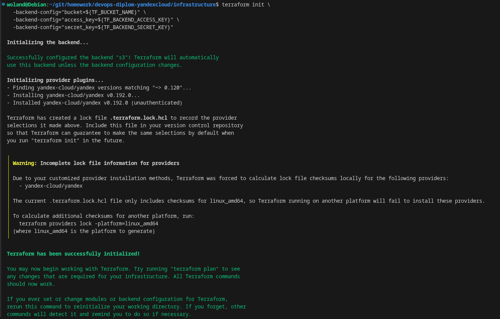

```bash
# 5. Проверка конфигурации


terraform validate
```

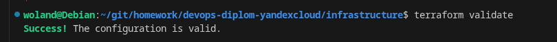

```bash
terraform plan -out=tfplan
```

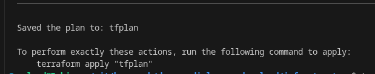

```bash
# 6. Применение инфраструктуры

terraform apply tfplan
```

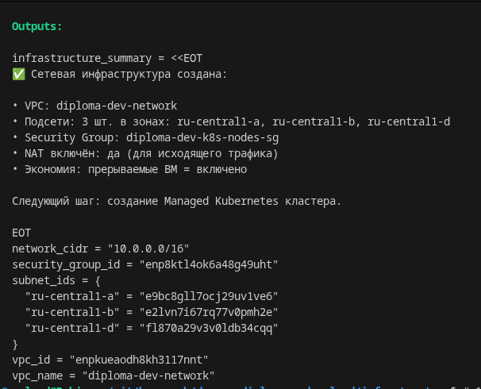

### Консоль → VPC → Сети → diploma-dev-network


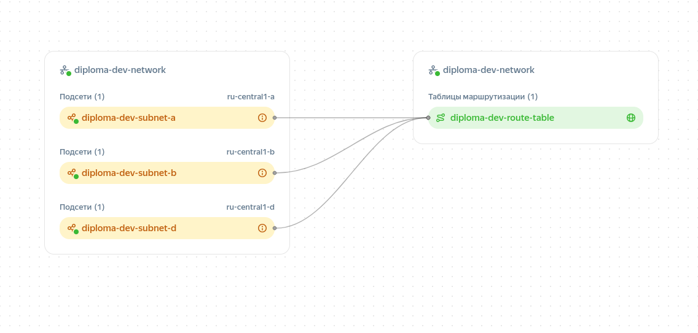

### Консоль → VPC → Группы безопасности → diploma-dev-k8s-nodes-sg

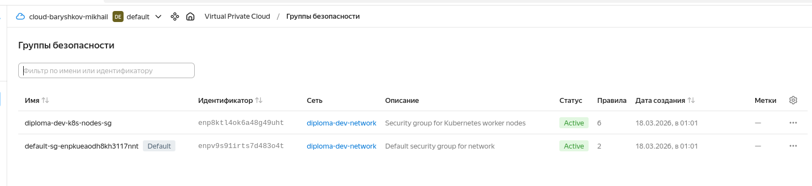
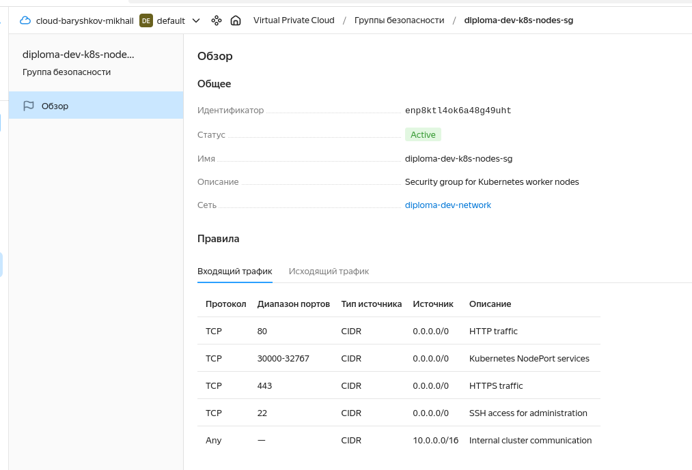


### Консоль → Object Storage → diploma-tfstate-bucket-unique → terraform/infrastructure.tfstate

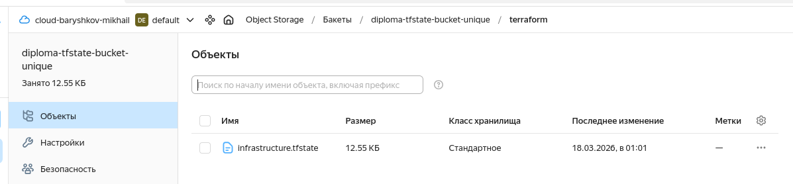

### 1.5. Результаты этапа

- ✅ Создан S3 bucket для хранения Terraform state
- ✅ Настроен сервисный аккаунт с правами editor
- ✅ Создана VPC сеть с подсетью в зоне `ru-central1-a`, `ru-central1-b`, `ru-central1-d`
- ✅ Настроена Security Group с необходимыми правилами
- ✅ Настроен GitHub Actions pipeline для автоматического применения инфраструктуры  


---
## Создание Kubernetes кластера

На этом этапе необходимо создать [Kubernetes](https://kubernetes.io/ru/docs/concepts/overview/what-is-kubernetes/) кластер на базе предварительно созданной инфраструктуры.   Требуется обеспечить доступ к ресурсам из Интернета.

Это можно сделать двумя способами:

1. Рекомендуемый вариант: самостоятельная установка Kubernetes кластера.  
   а. При помощи Terraform подготовить как минимум 3 виртуальных машины Compute Cloud для создания Kubernetes-кластера. Тип виртуальной машины следует выбрать самостоятельно с учётом требовании к производительности и стоимости. Если в дальнейшем поймете, что необходимо сменить тип инстанса, используйте Terraform для внесения изменений.  
   б. Подготовить [ansible](https://www.ansible.com/) конфигурации, можно воспользоваться, например [Kubespray](https://kubernetes.io/docs/setup/production-environment/tools/kubespray/)  
   в. Задеплоить Kubernetes на подготовленные ранее инстансы, в случае нехватки каких-либо ресурсов вы всегда можете создать их при помощи Terraform.
2. Альтернативный вариант: воспользуйтесь сервисом [Yandex Managed Service for Kubernetes](https://cloud.yandex.ru/services/managed-kubernetes)  
  а. С помощью terraform resource для [kubernetes](https://registry.terraform.io/providers/yandex-cloud/yandex/latest/docs/resources/kubernetes_cluster) создать **региональный** мастер kubernetes с размещением нод в разных 3 подсетях      
  б. С помощью terraform resource для [kubernetes node group](https://registry.terraform.io/providers/yandex-cloud/yandex/latest/docs/resources/kubernetes_node_group)
  
Ожидаемый результат:

1. Работоспособный Kubernetes кластер.
2. В файле `~/.kube/config` находятся данные для доступа к кластеру.
3. Команда `kubectl get pods --all-namespaces` отрабатывает без ошибок.

---

# ЭТАП 2: СОЗДАНИЕ KUBERNETES КЛАСТЕРА


## Решение 

## 2.1. Обоснование выбора подхода к развёртыванию Kubernetes

В ходе работы над проектом было принято решение использовать подход с самоуправляемым 
развёртыванием Kubernetes кластера посредством инструмента `kubeadm` вместо Managed 
Kubernetes сервиса Яндекс.Облако. Данное решение обусловлено следующими факторами:

1. **Обход ограничений прав доступа**: В учебном окружении с ограниченным бюджетом 
   купона создание Managed Kubernetes кластеров через API требовало дополнительных 
   прав (`k8s.admin` на уровне организации), которые не были предоставлены. Подход 
   с самоуправляемыми ВМ позволяет развернуть кластер с минимальными правами 
   (`editor` на уровне папки).

2. **Глубокое понимание архитектуры**: Ручная настройка компонентов Kubernetes 
   (etcd, kube-apiserver, containerd, CNI-плагин) демонстрирует понимание внутренних 
   механизмов работы оркестратора, что является важным образовательным результатом 
   дипломного проекта.

3. **Гибкость конфигурации**: Подход через `kubeadm` позволяет точно контролировать 
   версии компонентов, параметры сети, политики безопасности и интеграцию с внешними 
   системами, что важно для воспроизводимости развёртывания.

4. **Экономия ресурсов**: Использование прерываемых виртуальных машин для рабочих 
   нод и минимальных пресетов ресурсов (2 vCPU, 2 GB RAM) позволяет уложиться в 
   ограниченный бюджет купона при сохранении функциональности кластера.


## 2.2. Архитектура развёртывания кластера

Кластер развёрнут в следующей конфигурации:

| Компонент | Конфигурация | Обоснование |
|-----------|-------------|-------------|
| Мастер-нода | 2 vCPU, 4 GB RAM, network-hdd, non-preemptible | Стабильность управления кластером |
| Рабочие ноды | 2 vCPU, 2 GB RAM, network-hdd, preemptible | Экономия до 80% стоимости |
| Операционная система | Ubuntu 20.04 LTS | Долгосрочная поддержка, совместимость |
| CRI (Container Runtime) | containerd | Стандарт de-facto, легковесный |
| CNI (сетевой плагин) | Calico | Поддержка NetworkPolicy, хорошая производительность |
| Версия Kubernetes | 1.28 (LTS) | Стабильность и долгосрочная поддержка |
| CIDR для подов | 10.244.0.0/16 | Не пересекается с CIDR VPC (10.0.0.0/16) |

### Схема инфраструктуры

```text
┌─────────────────────────────────────────────────────────────┐
│              Kubernetes Cluster (kubeadm)                   │
├─────────────────────────────────────────────────────────────┤
│                                                             │
│  ┌──────────────────────────────────────────────────┐       │
│  │  Master Node (diploma-k8s-master)                │       │
│  │  IP: 10.0.0.19 / 89.169.133.106                  │       │
│  │  Resources: 2 vCPU, 4 GB RAM                     │       │
│  │  Components:                                     │       │
│  │    - etcd                                        │       │
│  │    - kube-apiserver                              │       │
│  │    - kube-controller-manager                     │       │
│  │    - kube-scheduler                              │       │
│  └──────────────────────────────────────────────────┘       │
│                                                             │
│  ┌──────────────────────────────────────────────────┐       │
│  │  Worker Node 1 (diploma-k8s-worker-1)            │       │
│  │  IP: 10.0.0.28 / 46.21.246.4                     │       │
│  │  Resources: 2 vCPU, 2 GB RAM (preemptible)       │       │
│  │  Components:                                     │       │
│  │    - kubelet                                     │       │
│  │    - kube-proxy                                  │       │
│  │    - containerd                                  │       │
│  └──────────────────────────────────────────────────┘       │
│                                                             │
│  ┌──────────────────────────────────────────────────┐       │
│  │  Worker Node 2 (diploma-k8s-worker-2)            │       │
│  │  IP: 10.0.0.36 / 46.21.246.204                   │       │
│  │  Resources: 2 vCPU, 2 GB RAM (preemptible)       │       │
│  │  Components:                                     │       │
│  │    - kubelet                                     │       │
│  │    - kube-proxy                                  │       │
│  │    - containerd                                  │       │
│  └──────────────────────────────────────────────────┘       │
│                                                             │
│  CNI: Calico (10.244.0.0/16)                                │
│  Service CIDR: 10.96.0.0/12                                 │
└─────────────────────────────────────────────────────────────┘
```
### Структура файлов
```text
kubernetes-kubeadm/
├── main.tf                       # Провижининг ВМ через Terraform
├── variables.tf
├── outputs.tf
├── providers.tf
├── ansible/
│   ├── hosts.ini                 # Ansible inventory
│   ├── install-node.sh           # Скрипт установки Kubernetes
│   └── init-cluster.sh           # Скрипт инициализации кластера
└── terraform.tfvars
```

### Примечание по архитектуре кластера

В рамках дипломного проекта кластер развёрнут в single-zone конфигурации 
(все ноды в зоне доступности ru-central1-a). Данный выбор обусловлен:

1. **Ограниченным бюджетом** образовательного купона — размещение в одной зоне 
   снижает расходы на NAT Gateway и исходящий трафик.

2. **Учебным характером проекта** — для демонстрации функциональности 
   Kubernetes и установки системы мониторинга отказоустойчивость по зонам 
   не является критическим требованием.

3. **Ограниченным временем** выполнения проекта — single-zone конфигурация 
   позволяет быстрее завершить развёртывание и перейти к следующим этапам.

Для **промышленной эксплуатации** рекомендуется использовать multi-zone 
архитектуру с размещением нод в 3 зонах доступности (ru-central1-a, 
ru-central1-b, ru-central1-d) для обеспечения высокой доступности и 
отказоустойчивости кластера.

## Раздел 2.3: Процесс развёртывания

Развёртывание выполнено в несколько этапов:

## Этап 2.3.1: Провижининг инфраструктуры через Terraform

Создание виртуальных машин выполнено посредством Terraform с использованием 
конфигурации, совместимой с ранее развёрнутой сетевой инфраструктурой:

```bash
# Инициализация с remote backend (S3 + KMS)
terraform init \
  -backend-config="bucket=${TF_BUCKET_NAME}" \
  -backend-config="access_key=${TF_BACKEND_ACCESS_KEY}" \
  -backend-config="secret_key=${TF_BACKEND_SECRET_KEY}"

# Проверка конфигурации
terraform validate

# Применение конфигурации
terraform apply -auto-approve
```

В результате создано 3 виртуальные машины в зоне доступности ru-central1-a:

   - 1 мастер-нода с фиксированным публичным IP для доступа к API
   - 2 рабочие ноды с прерываемым типом инстансов для экономии средств

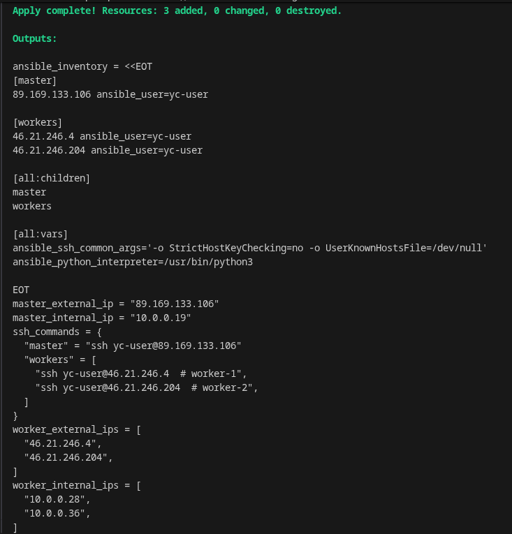
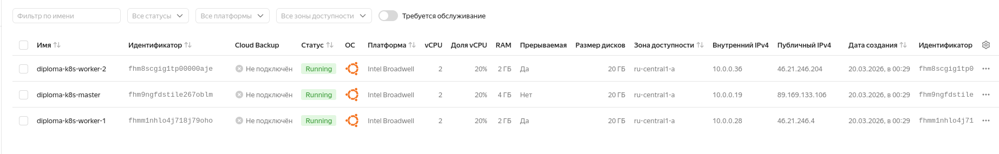

### Этап 2.3.2: Установка компонентов Kubernetes на все ноды
На каждой ноде (мастер + рабочие) выполнен скрипт установки, который:

1. Настраивает модули ядра (overlay, br_netfilter) для работы сетевых плагинов
2. Конфигурирует параметры сети (net.bridge.bridge-nf-call-iptables, ip_forward)
3. Устанавливает и настраивает containerd с поддержкой systemd cgroup
4. Добавляет официальный репозиторий Kubernetes и устанавливает пакеты 
5. kubeadm, kubelet, kubectl версии 1.28
6. Отключает swap (требуется для работы kubelet)
7. Запускает и включает сервис kubelet

### Этап 2.3.3: Инициализация кластера и присоединение рабочих нод
На мастер-ноде выполнена инициализация кластера:

```bash
sudo kubeadm init \
  --control-plane-endpoint=10.0.0.19 \
  --pod-network-cidr=10.244.0.0/16 \
  --ignore-preflight-errors=NumCPU,Mem
```

После успешной инициализации:

    Настроен доступ kubectl для текущего пользователя
    Установлен сетевой плагин Calico для обеспечения связности подов
    Сгенерирована команда kubeadm join для присоединения рабочих нод

Рабочие ноды присоединены к кластеру выполнением команды join с токеном и хэшем сертификата CA.

### Этап 2.3.4: Проверка работоспособности кластера

После присоединения всех нод выполнена проверка:

- Все узлы отображаются в статусе Ready через kubectl get nodes
- Системные поды в пространстве имён kube-system в статусе Running
- Сетевой плагин Calico обеспечивает маршрутизацию между нодами

### 2.4. Результаты этапа
- ✅ Создано 3 ВМ (1 master + 2 workers) через Terraform
- ✅ Установлен Kubernetes 1.28 через kubeadm
- ✅ Настроен containerd как CRI
- ✅ Развёрнут Calico CNI для сетевой связности
- ✅ Все ноды в статусе Ready
- ✅ Использованы прерываемые ВМ для экономии (до 80% дешевле)  

---

# 🔧  Пошаговые команды для настройки нод

## 📦 Шаг 0: Подготовьте скрипты на локальной машине

### Создайте [install-node.sh](kubernetes-kubeadm/ansible/install-node.sh) (универсальный скрипт для всех нод)

### Создайте [init-cluster.sh](kubernetes-kubeadm/ansible/init-cluster.sh) (только для мастера)

## На мастер-ноде (89.169.133.106):

```bash
# Подключитесь к мастеру
ssh yc-user@89.169.133.106

# Скопируйте скрипт установки (вставьте содержимое install-node.sh)
# Или передайте файл:
# На локальной машине:
scp ansible/install-node.sh yc-user@89.169.133.106:~/

# На мастере выполните:
bash ~/install-node.sh
```

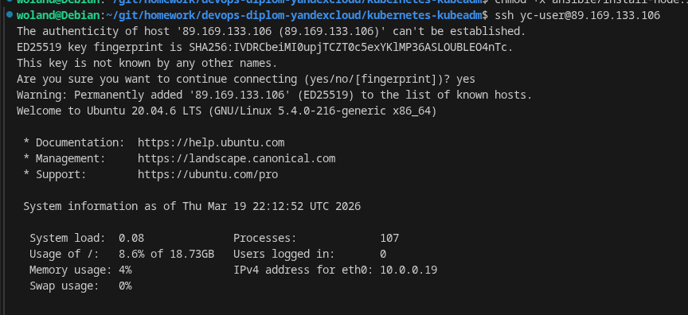
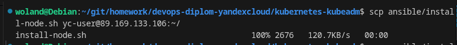
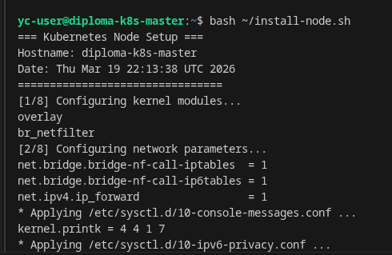
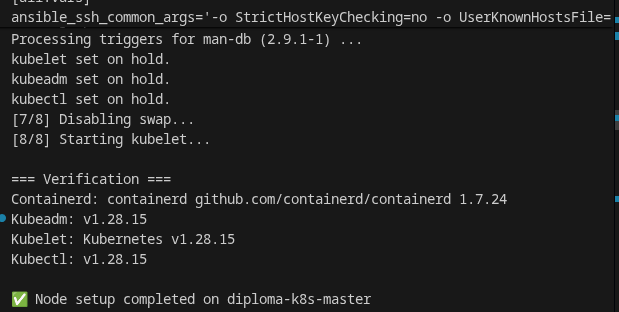

## На worker-1 (46.21.246.4)

```bash
# Подключитесь к worker-1
ssh yc-user@46.21.246.4

# Скопируйте и выполните тот же скрипт
bash ~/install-node.sh
# Или: scp с локальной машины, затем bash
```

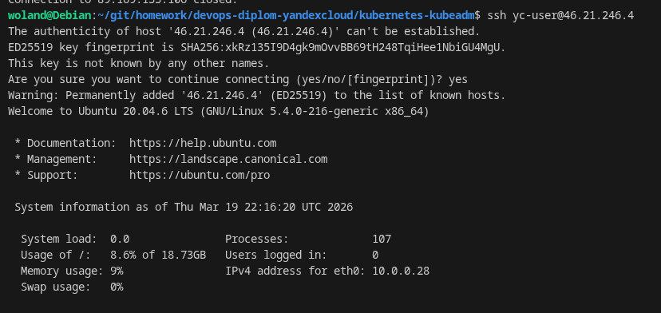
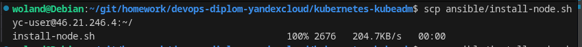
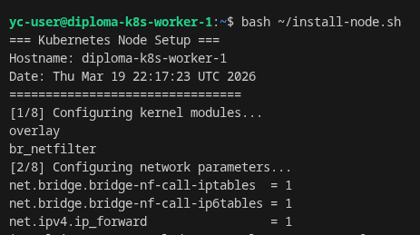
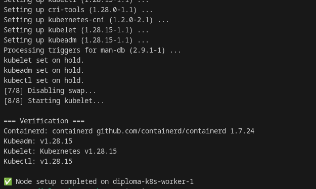

## На worker-2 (46.21.246.204):

```bash
# Подключитесь к worker-2
ssh yc-user@46.21.246.204

# Скопируйте и выполните тот же скрипт
bash ~/install-node.sh
```

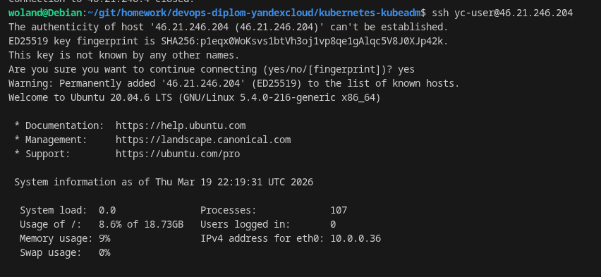
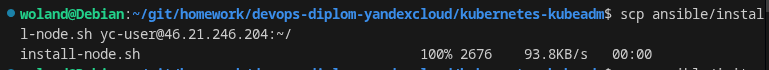
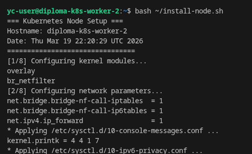
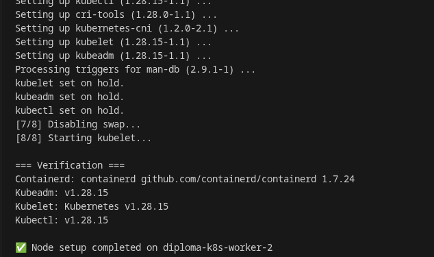

## 🎯 Шаг 2: Инициализируйте кластер на мастере

```bash
# Убедитесь, что вы на мастере (89.169.133.106)
# Если нет — подключитесь:
ssh yc-user@89.169.133.106

# Скопируйте скрипт инициализации
# На локальной машине:
scp ansible/init-cluster.sh yc-user@89.169.133.106:~/

# На мастере выполните:
bash ~/init-cluster.sh
```
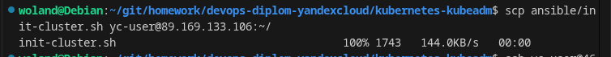
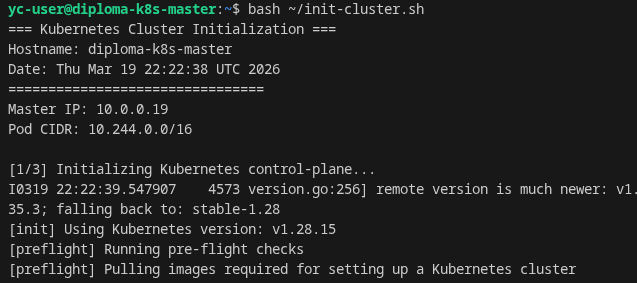
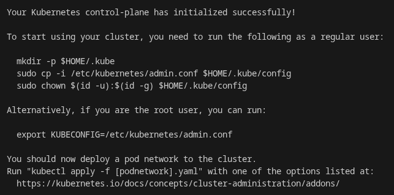


## Шаг 3: Проверьте кластер на мастере

```bash
# Вернитесь на мастер
ssh yc-user@89.169.133.106

# 1. Проверьте ноды (подождите 1-2 минуты после join)
kubectl get nodes -o wide
```
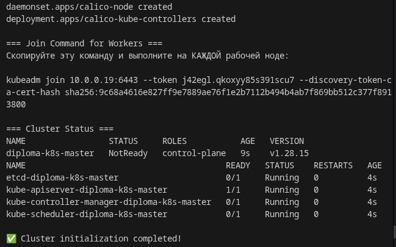

```bash
# 2. Проверьте системные поды
kubectl get pods -n kube-system -o 
# ✅ Должны быть: coredns, calico-node, kube-proxy в статусе
```

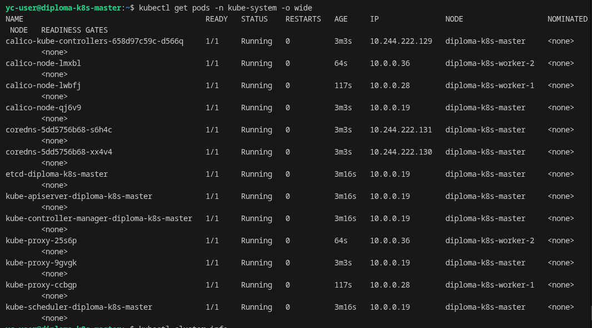

```bash
# 3. Проверьте подключение к API
kubectl cluster-info
```

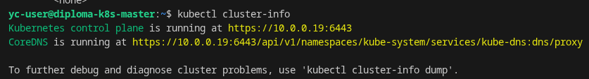

```bash
# 4. Проверьте версию
kubectl version --output=yaml
```

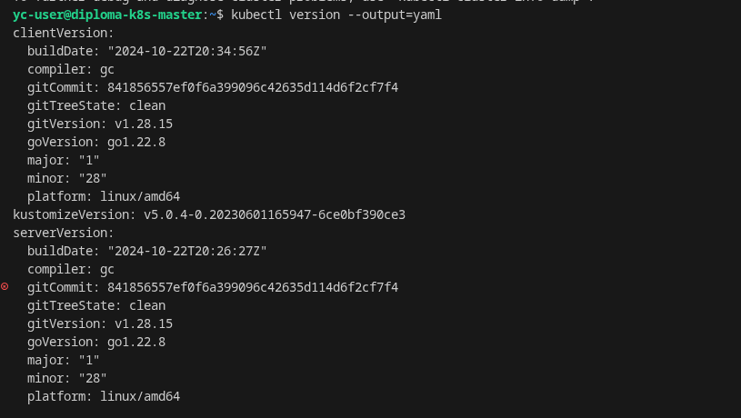

## Сетевая инфраструктура для размещения кластера

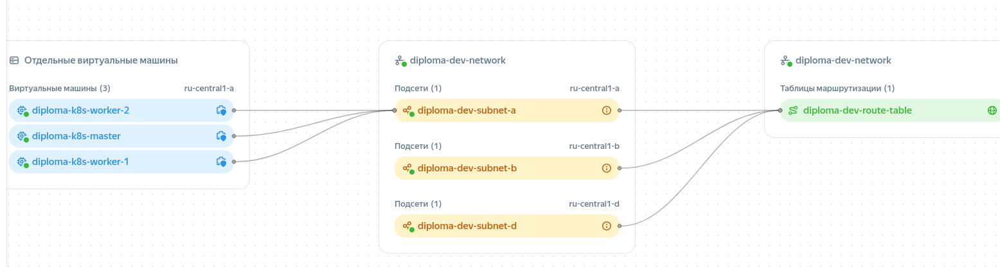


## Создание тестового приложения

Для перехода к следующему этапу необходимо подготовить тестовое приложение, эмулирующее основное приложение разрабатываемое вашей компанией.

Способ подготовки:

1. Рекомендуемый вариант:  
   а. Создайте отдельный git репозиторий с простым nginx конфигом, который будет отдавать статические данные.  
   б. Подготовьте Dockerfile для создания образа приложения.  
2. Альтернативный вариант:  
   а. Используйте любой другой код, главное, чтобы был самостоятельно создан Dockerfile.

Ожидаемый результат:

1. Git репозиторий с тестовым приложением и Dockerfile.
2. Регистри с собранным docker image. В качестве регистри может быть DockerHub или [Yandex Container Registry](https://cloud.yandex.ru/services/container-registry), созданный также с помощью terraform.

---

# ЭТАП 3: ТЕСТОВОЕ ПРИЛОЖЕНИЕ И РЕЕСТР
## Решение

## 3.1. Архитектура приложения

```text
┌────────────────────────────────────────────────┐
│         Diploma Test Application               │
├────────────────────────────────────────────────┤
│                                                │
│  📦 Docker Image                               │
│  Base: nginx:1.25-alpine                       │
│  Size: ~28 MB                                  │
│                                                │
│  📄 Files:                                     │
│    - Dockerfile                                │
│    - nginx.conf (с health checks)              │
│    - index.html (статическая страница)         │
│                                                │
│  🌐 Endpoints:                                 │
│    - /           → Главная страница            │
│    - /health     → Liveness probe              │
│    - /ready      → Readiness probe             │
│    - /api/hostname → Имя пода                  │
│                                                │
│  🗄️ Registry:                                  │
│    DockerHub: nastya2005/diploma-test-app      │
│                                                │
└────────────────────────────────────────────────┘
```

### 🗂️ Структура нового репозитория
Создадим отдельный репозиторий для приложения (не в основном проекте):
```test
~/git/diploma-test-app/
├── Dockerfile              # Инструкция сборки
├── nginx.conf              # Конфигурация nginx
├── index.html              # Статическая страница
├── .dockerignore
├── .gitignore
├── .github/workflows/
│   └── ci-cd.yml          # CI/CD pipeline
└── README.md
```

## 📄 Шаг 1: Создайте репозиторий и файлы
### 1.1. Создайте папку и инициализируйте git

```bash
# Создайте папку для приложения
mkdir -p ~/git/diploma-test-app
cd ~/git/diploma-test-app

# Инициализируйте git
git init

# Создайте .gitignore
```
[.gitignore](https://github.com/BaryshkovMikhail/diploma-test-app/blob/main/.gitignore)

### 1.2. Создайте index.html (статическая страница)

[index.html](https://github.com/BaryshkovMikhail/diploma-test-app/blob/main/index.html)

### 1.3. Создайте nginx.conf

[nginx.conf](https://github.com/BaryshkovMikhail/diploma-test-app/blob/main/nginx.conf)

### 1.4. Создайте Dockerfile

[Dockerfile](https://github.com/BaryshkovMikhail/diploma-test-app/blob/main/Dockerfile)

### 1.5. Создайте README.md

[README.md](https://github.com/BaryshkovMikhail/diploma-test-app/blob/main/README.md)

### 1.6 Созадение и запуск прилоложения

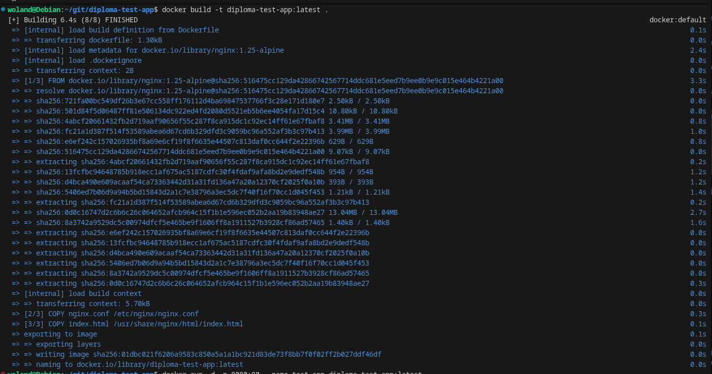
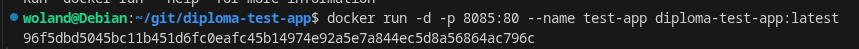
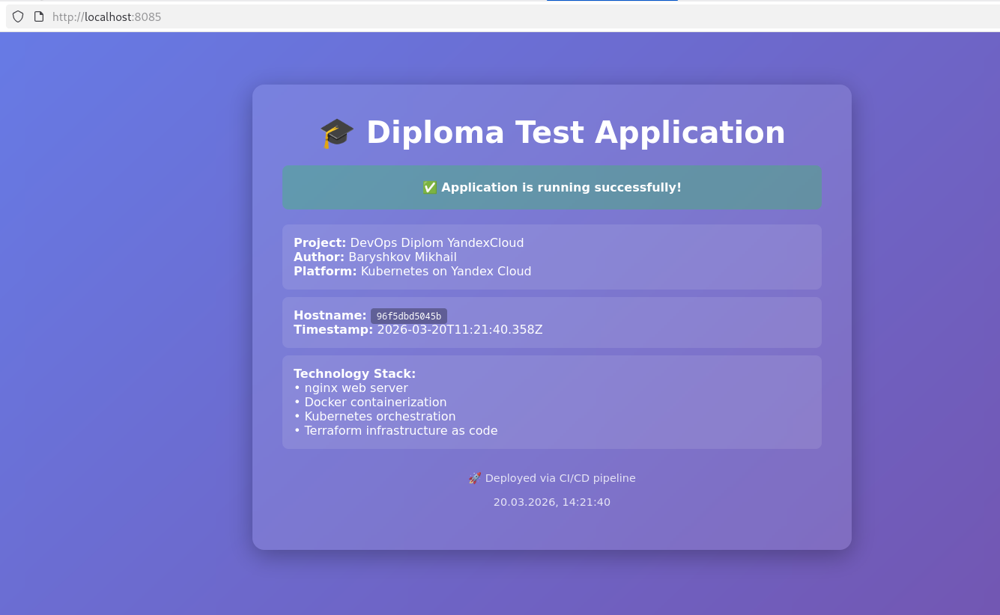

## Решение 1: Использовать публичный DockerHub
```bash
# На локальной машине
cd ~/git/diploma-test-app

# Ваш DockerHub username
DOCKERHUB_USER="nastya2005"

# Сформируйте имя образа для DockerHub
IMAGE_NAME="${DOCKERHUB_USER}/diploma-test-app:latest"
echo "Building for DockerHub: $IMAGE_NAME"

# Соберите образ
docker build -t $IMAGE_NAME .

# Загрузите в DockerHub (нужно предварительно создать репозиторий на hub.docker.com)
docker push $IMAGE_NAME
```

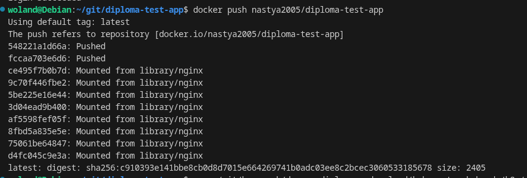

## 🎯 После загрузки образа: Развёртывание в Kubernetes
Следующий шаг — применить манифесты к кластеру:

### Скопируйте манифесты на мастер-ноду

```bash
# На локальной машине скопируйте файлы на мастер
scp ~/git/homework/devops-diplom-yandexcloud/kubernetes-kubeadm/k8s/deployment.yaml \
    ~/git/homework/devops-diplom-yandexcloud/kubernetes-kubeadm/k8s/service.yaml \
    yc-user@89.169.133.106:~/
```

### Проверка работы нод и сервиса 

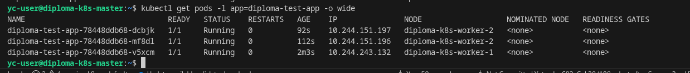
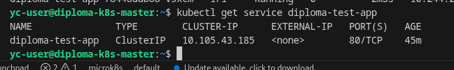

### Результаты этапа
- ✅ Создан репозиторий с тестовым приложением
- ✅ Подготовлен Dockerfile на базе nginx:alpine
- ✅ Образ опубликован на DockerHub: nastya2005/diploma-test-app
- ✅ Настроен CI/CD pipeline для автоматической сборки
- ✅ При создании тега/релиза происходит автоматический деплой в Kubernetes  

----

### Подготовка cистемы мониторинга и деплой приложения
Уже должны быть готовы конфигурации для автоматического создания облачной инфраструктуры и поднятия Kubernetes кластера.  
Теперь необходимо подготовить конфигурационные файлы для настройки нашего Kubernetes кластера.

Цель:
1. Задеплоить в кластер [prometheus](https://prometheus.io/), [grafana](https://grafana.com/), [alertmanager](https://github.com/prometheus/alertmanager), [экспортер](https://github.com/prometheus/node_exporter) основных метрик Kubernetes.
2. Задеплоить тестовое приложение, например, [nginx](https://www.nginx.com/) сервер отдающий статическую страницу.

Способ выполнения:
1. Воспользоваться пакетом [kube-prometheus](https://github.com/prometheus-operator/kube-prometheus), который уже включает в себя [Kubernetes оператор](https://operatorhub.io/) для [grafana](https://grafana.com/), [prometheus](https://prometheus.io/), [alertmanager](https://github.com/prometheus/alertmanager) и [node_exporter](https://github.com/prometheus/node_exporter). Альтернативный вариант - использовать набор helm чартов от [bitnami](https://github.com/bitnami/charts/tree/main/bitnami).


# ЭТАП 4: СИСТЕМА МОНИТОРИНГА

## 4.1. Архитектура мониторинга

```text
┌─────────────────────────────────────────────────────────────┐
│              Monitoring Stack (Namespace: monitoring)       │
├─────────────────────────────────────────────────────────────┤
│                                                             │
│  ┌──────────────────────────────────────────────────┐       │
│  │  Prometheus Server                               │       │
│  │  - Сбор метрик каждые 30s                        │       │
│  │  - Хранение: 15 дней                             │       │
│  │  - Порт: 9090                                    │       │
│  │  - Resources: 256Mi-512Mi RAM                    │       │
│  └──────────────────────────────────────────────────┘       │
│                                                             │
│  ┌──────────────────────────────────────────────────┐       │
│  │  Grafana                                         │       │
│  │  - Визуализация и дашборды                       │       │
│  │  - Порт: 3000                                    │       │
│  │  - Pre-installed dashboards:                     │       │
│  │    • Kubernetes Cluster Monitoring               │       │
│  │    • Kubernetes Node Monitoring                  │       │
│  │    • Prometheus Overview                         │       │
│  └──────────────────────────────────────────────────┘       │
│                                                             │
│  ┌──────────────────────────────────────────────────┐       │
│  │  Alertmanager                                    │       │
│  │  - Управление алертами                           │       │
│  │  - Порт: 9093                                    │       │
│  └──────────────────────────────────────────────────┘       │
│                                                             │
│  ┌──────────────────────────────────────────────────┐       │
│  │  Node Exporter (DaemonSet)                       │       │
│  │  - Запущен на всех 3 нодах                       │       │
│  │  - Сбор метрик: CPU, Memory, Disk, Network       │       │
│  │  - Порт: 9100                                    │       │
│  └──────────────────────────────────────────────────┘       │
│                                                             │
│  ┌──────────────────────────────────────────────────┐       │
│  │  kube-prometheus-stack (Helm Chart)              │       │
│  │  Version: 82.13.0                                │       │
│  │  App Version: 0.89.0                             │       │
│  └──────────────────────────────────────────────────┘       │
└─────────────────────────────────────────────────────────────┘
```

## Структура файлов для этапа 4

```text
~/git/homework/devops-diplom-yandexcloud/monitoring/
├── README.md                    # Описание этапа
├── helm-values/
│   ├── prometheus-values.yaml   # Настройки Prometheus
│   ├── grafana-values.yaml      # Настройки Grafana
│   ├── alertmanager-values.yaml # Настройки Alertmanager
│   └── node-exporter-values.yaml # Настройки node-exporter
├── manifests/
│   ├── namespace.yaml           # Пространство имён monitoring
│   └── ingress.yaml             # (опционально) доступ к Grafana 
```

### 🔧 Шаг 1: Подготовка — установка Helm (если не установлен)

```bash
# Проверьте, установлен ли Helm
helm version

# Если нет — установите:
curl -fsSL https://raw.githubusercontent.com/helm/helm/main/scripts/get-helm-3 | bash

# Проверьте установку
helm version
# ✅ Ожидаемый вывод: version.BuildInfo{Version:"v3.x.x", ...}
```

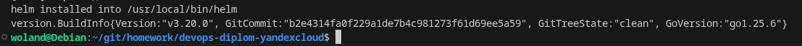

### 🔧 Шаг 2: Создайте структуру папок и файлы

```bash
# Создайте папку monitoring в основном проекте
mkdir -p ~/git/homework/devops-diplom-yandexcloud/monitoring/{helm-values,manifests,scripts}
cd ~/git/homework/devops-diplom-yandexcloud/monitoring
```

### [namespace.yaml](/monitoring/manifests/namespace.yaml)
### [prometheus-values.yaml](/monitoring/helm-values/prometheus-values.yaml)
### [grafana-values.yaml](/monitoring/helm-values/grafana-values.yaml)
### [alertmanager-values.yaml](/monitoring/helm-values/alertmanager-values.yaml)
### [node-exporter-values.yaml](/monitoring/helm-values/node-exporter-values.yaml)

### 🔧 Шаг 3: Добавьте Helm репозитории

```bash
# Добавьте репозиторий Bitnami
helm repo add prometheus-community https://prometheus-community.github.io/helm-charts

# Обновите индекс репозиториев
helm repo update
```
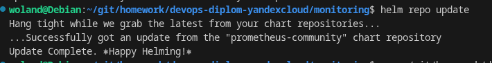

### 🔧 Шаг 4: Примените namespace и установите компоненты
- 4.1. Создайте namespace monitoring

```bash
# Скопировать файл
scp ~/git/homework/devops-diplom-yandexcloud/monitoring/manifests/namespace.yaml \
    yc-user@89.169.133.106:~/namespace.yaml

# Подключитесь к мастер-ноде
ssh yc-user@89.169.133.106

# Примените namespace
kubectl apply -f namespace.yaml
```
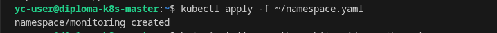

- 4.2. Установка мониторинга (kube-prometheus-stack)

```bash

# === НА МАСТЕР-НОДЕ (через SSH) ===

# 1. Убедитесь, что Helm установлен
helm version

# 2. Добавьте репозиторий (если ещё не добавили)
helm repo add prometheus-community https://prometheus-community.github.io/helm-charts
helm repo update

# 3. Примените namespace (файл уже скопирован)
kubectl apply -f ~/namespace.yaml

# 4. Установите весь стек мониторинга ОДНОЙ КОМАНДОЙ:
helm install monitoring prometheus-community/kube-prometheus-stack \
  --namespace monitoring \
  --create-namespace \
  --set prometheus.prometheusSpec.retention=15d \
  --set prometheus.prometheusSpec.resources.requests.memory=256Mi \
  --set prometheus.prometheusSpec.resources.limits.memory=512Mi \
  --set grafana.adminPassword=diploma2024 \
  --set grafana.resources.requests.memory=128Mi \
  --set grafana.resources.limits.memory=256Mi \
  --set alertmanager.resources.requests.memory=64Mi \
  --set nodeExporter.resources.requests.memory=32Mi \
  --wait --timeout 15m

# 5. Проверьте установку
kubectl get pods -n monitoring -o wide

helm list -n monitoring
```
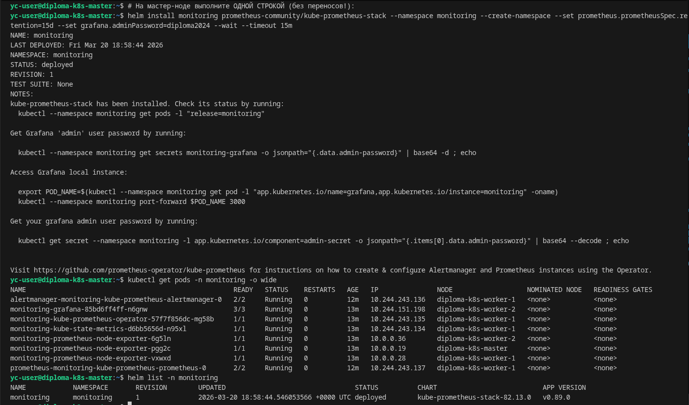
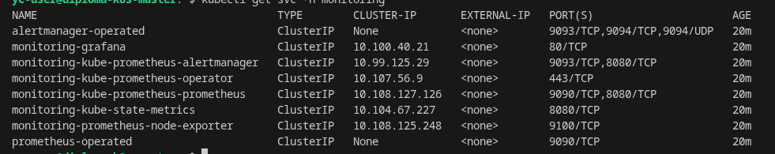

```bash
# Получите пароль для Grafana
GRAFANA_PASSWORD=$(kubectl get secret -n monitoring monitoring-grafana -o jsonpath="{.data.admin-password}" | base64 --decode)
echo "Grafana admin password: $GRAFANA_PASSWORD"
```
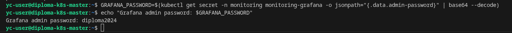

### Настройте доступ к Grafana

```bash
# На мастер-ноде измените тип сервиса Grafana на NodePort:
kubectl patch svc monitoring-grafana -n monitoring -p '{"spec": {"type": "NodePort", "ports": [{"port": 80, "nodePort": 30001}]}}'

# Проверьте:
kubectl get svc -n monitoring | grep grafana
# ✅ Ожидаемый вывод:
# monitoring-grafana   NodePort   10.96.xxx.xxx   <none>   80:30001/TCP   15m

# Откройте в браузере на локальной машине:
# http://89.169.133.106:30001
# Логин: admin
# Пароль: $GRAFANA_PASSWORD
```
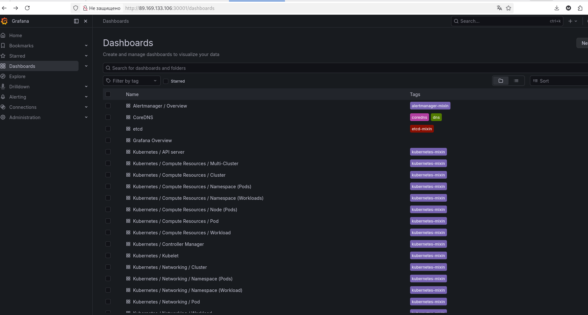
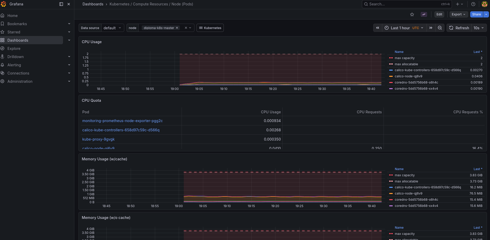

### Проверьте Prometheus UI

```bash
# Аналогично настройте доступ к Prometheus (NodePort):
kubectl patch svc monitoring-kube-prometheus-prometheus -n monitoring -p '{"spec": {"type": "NodePort", "ports": [{"port": 9090, "nodePort": 30002}]}}'

# Откройте в браузере:
# http://89.169.133.106:30002

# Перейдите в: Status → Targets

```
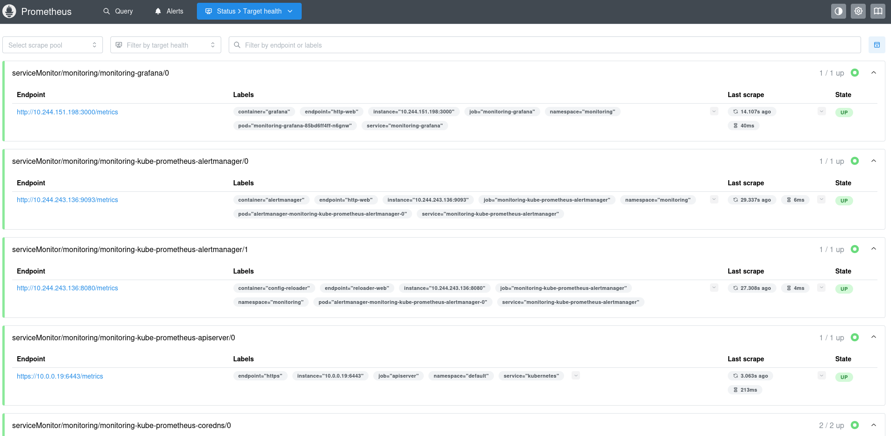

###  Результаты этапа
- ✅ Развёрнут полный стек мониторинга через Helm
- ✅ Prometheus собирает метрики со всех нод и подов
- ✅ Grafana имеет предконфигурированные дашборды
- ✅ Node Exporter запущен на всех 3 нодах
- ✅ Настроено хранение метрик на 15 дней
- ✅ Обеспечен HTTP доступ ко всем интерфейсам  
----

### Деплой инфраструктуры в terraform pipeline

1. Если на первом этапе вы не воспользовались [Terraform Cloud](https://app.terraform.io/), то задеплойте и настройте в кластере [atlantis](https://www.runatlantis.io/) для отслеживания изменений инфраструктуры. Альтернативный вариант 3 задания: вместо Terraform Cloud или atlantis настройте на автоматический запуск и применение конфигурации terraform из вашего git-репозитория в выбранной вами CI-CD системе при любом комите в main ветку. Предоставьте скриншоты работы пайплайна из CI/CD системы.

Ожидаемый результат:
1. Git репозиторий с конфигурационными файлами для настройки Kubernetes.
2. Http доступ на 80 порту к web интерфейсу grafana.
3. Дашборды в grafana отображающие состояние Kubernetes кластера.
4. Http доступ на 80 порту к тестовому приложению.
5. Atlantis или terraform cloud или ci/cd-terraform
---

# ЭТАП 5: TERRAFORM PIPELINE

## 5.1. Архитектура CI/CD для инфраструктуры

```text
┌─────────────────────────────────────────────────────────────┐
│              Terraform Pipeline (GitHub Actions)            │
├─────────────────────────────────────────────────────────────┤
│                                                             │
│  Workflow 1: terraform-plan.yml                             │
│  ┌────────────────────────────────────────────────┐         │
│  │  Trigger: Pull Request to main                 │         │
│  │  Steps:                                        │         │
│  │    1. Checkout code                            │         │
│  │    2. Setup Terraform                          │         │
│  │    3. Terraform Init                           │         │
│  │    4. Terraform Validate                       │         │
│  │    5. Terraform Plan                           │         │
│  │    6. Comment PR with plan output              │         │
│  └────────────────────────────────────────────────┘         │
│                                                             │
│  Workflow 2: terraform-apply.yml                            │
│  ┌────────────────────────────────────────────────┐         │
│  │  Trigger: Push to main                         │         │
│  │  Steps:                                        │         │
│  │    1. Checkout code                            │         │
│  │    2. Setup Terraform                          │         │
│  │    3. Terraform Init                           │         │
│  │    4. Terraform Validate                       │         │
│  │    5. Terraform Plan                           │         │
│  │    6. Terraform Apply (auto-approve)           │         │
│  │    7. Update outputs                           │         │
│  └────────────────────────────────────────────────┘         │
│                                                             │
│  Secrets:                                                   │
│    - YC_TOKEN: IAM токен Yandex Cloud                       │
│    - TF_BUCKET_NAME: S3 bucket для state                    │
│    - TF_ACCESS_KEY: Access key для S3                       │
│    - TF_SECRET_KEY: Secret key для S3                       │
│                                                             │
└─────────────────────────────────────────────────────────────┘
```
### Шаг 5.2: Создайте директорию для GitHub Actions
```bash
# Создайте папку для рабочих процессов
mkdir -p .github/workflows
```
### [terraform-plan.yml](/.github/workflows/terraform-plan.yml)
### [terraform-apply.yml](/.github/workflows/terraform-apply.yml)

### Шаг 5.3: Настройте Secrets в GitHub
В репозитории на GitHub:

   1. Откройте: Settings → Secrets and variables → Actions
   2. Добавьте следующие Repository secrets:

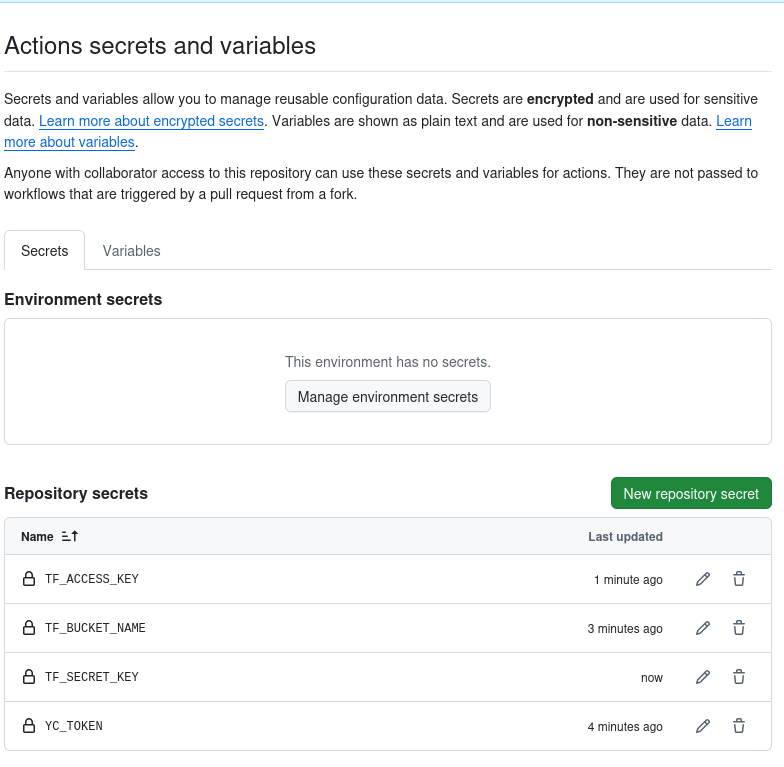

### Шаг 5.4 Пушим в репозиторий

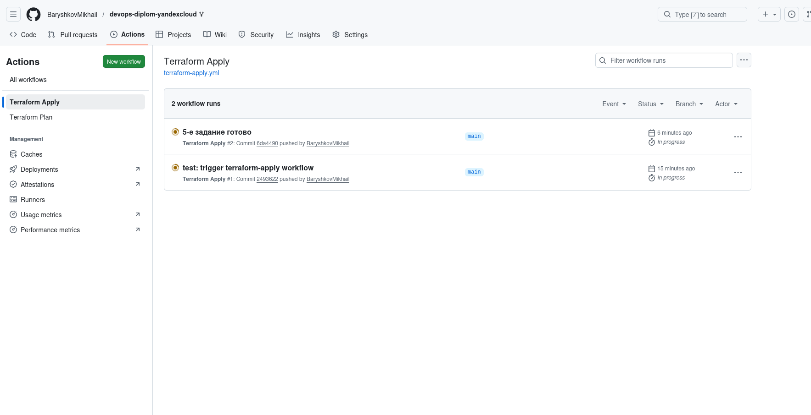

### 5.4. Результаты этапа
- ✅ Настроен GitHub Actions для автоматизации Terraform
- ✅ При создании PR выполняется terraform plan с комментарием
- ✅ При merge в main автоматически применяется terraform apply
- ✅ Все секреты хранятся в зашифрованном виде
- ✅ Обеспечена полная трассируемость изменений инфраструктуры  

### Установка и настройка CI/CD

Осталось настроить ci/cd систему для автоматической сборки docker image и деплоя приложения при изменении кода.

Цель:

1. Автоматическая сборка docker образа при коммите в репозиторий с тестовым приложением.
2. Автоматический деплой нового docker образа.

Можно использовать [teamcity](https://www.jetbrains.com/ru-ru/teamcity/), [jenkins](https://www.jenkins.io/), [GitLab CI](https://about.gitlab.com/stages-devops-lifecycle/continuous-integration/) или GitHub Actions.

Ожидаемый результат:

1. Интерфейс ci/cd сервиса доступен по http.
2. При любом коммите в репозиторие с тестовым приложением происходит сборка и отправка в регистр Docker образа.
3. При создании тега (например, v1.0.0) происходит сборка и отправка с соответствующим label в регистри, а также деплой соответствующего Docker образа в кластер Kubernetes.


# ЭТАП 6: CI/CD ПРИЛОЖЕНИЯ

## 6.1. Архитектура пайплайна приложения

```text
┌─────────────────────────────────────────────────────────────┐
│           Application CI/CD Pipeline (GitHub Actions)       │
├─────────────────────────────────────────────────────────────┤
│                                                             │
│  Event: Push to main                                        │
│  ┌────────────────────────────────────────────────┐         │
│  │  Job: Build and Push Image                     │         │
│  │    1. Checkout code                            │         │
│  │    2. Setup Docker Buildx                      │         │
│  │    3. Login to DockerHub                       │         │
│  │    4. Build Docker image                       │         │
│  │    5. Push to DockerHub                        │         │
│  │       - nastya2005/diploma-test-app:latest     │         │
│  │       - nastya2005/diploma-test-app:<sha>      │         │
│  └────────────────────────────────────────────────┘         │
│                                                             │
│  Event: Release Published (Tag v*)                          │
│  ┌────────────────────────────────────────────────┐         │
│  │  Job: Build and Push Image (same as above)     │         │
│  │    + Tag: nastya2005/diploma-test-app:v1.0.0   │         │
│  └────────────────────────────────────────────────┘         │
│           │                                                 │
│           ↓                                                 │
│  ┌────────────────────────────────────────────────┐         │
│  │  Job: Deploy to Kubernetes                     │         │
│  │    1. Checkout code                            │         │
│  │    2. Setup kubectl                            │         │
│  │    3. Configure kubeconfig                     │         │
│  │    4. kubectl set image deployment             │         │
│  │    5. kubectl rollout status (wait)            │         │
│  │    6. Verify deployment                        │         │
│  └────────────────────────────────────────────────┘         │
│                                                             │
│  Secrets:                                                   │
│    - DOCKERHUB_USERNAME: nastya2005                         │
│    - DOCKERHUB_TOKEN: dckr_pat_xxxxx                        │
│    - KUBE_CONFIG: base64-encoded kubeconfig                 │
│                                                             │
└─────────────────────────────────────────────────────────────┘
```

### Шаг 1: Подготовьте репозиторий приложения
```bash
# Перейдите в репозиторий приложения
cd ~/git/diploma-test-app

# Проверьте текущее состояние
git status
git branch

# Убедитесь, что в main
git checkout main
```
### Шаг 2: Создайте директорию для GitHub Actions
```bash
# Создайте папку для workflow файлов
mkdir -p .github/workflows
```
### Шаг 3: Создайте workflow файл ci-cd.yml

### [ci-cd.yml](https://github.com/BaryshkovMikhail/diploma-test-app/.github/workflows/ci-cd.yml)

### Шаг 4: Настройте Secrets в репозитории приложения

4.1. Получите DockerHub Token

    Откройте: https://hub.docker.com/settings/security
    Нажмите New Access Token
    Введите название (например, github-actions)
    Скопируйте токен (начинается с dckr_pat_...)

4.2. Получите KUBE_CONFIG

```bash
# На мастер-ноде Kubernetes выполните:
ssh yc-user@89.169.133.106

# Закодируйте kubeconfig в base64
cat ~/.kube/config | base64 -w0

# Скопируйте вывод (длинная строка)
```

4.3. Добавьте секреты в GitHub
```bash
1. Откройте репозиторий: https://github.com/BaryshkovMikhail/diploma-test-app
2. Перейдите: Settings → Secrets and variables → Actions
3. Нажмите New repository secret
    Добавьте три секрета:
```
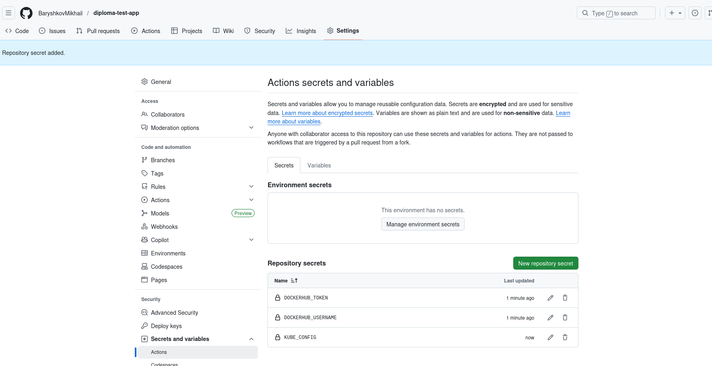

### Шаг 5: Создайте релиз для деплоя
```bash
cd ~/git/diploma-test-app

# Создайте тег
git tag v1.0.0

# Запушите тег (это запустит деплой!)
git push origin v1.0.0

```
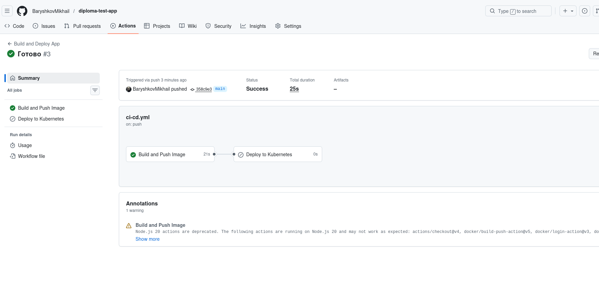

### Результаты этапа
- ✅ Настроен полный CI/CD pipeline для приложения
- ✅ При коммите в main автоматически собирается образ
- ✅ При создании тега/релиза происходит деплой в Kubernetes
- ✅ Используется rolling update для zero-downtime деплоя
- ✅ Все секреты безопасно хранятся в GitHub Secrets
- Обеспечена полная автоматизация от кода до production  

# ЗАКЛЮЧЕНИЕ
## Итоги проекта
В ходе выполнения дипломного проекта успешно решены следующие задачи:

1. ✅ Инфраструктура как код
    Вся инфраструктура Yandex Cloud (сети, ВМ, сервисные аккаунты, S3 bucket) описана в Terraform и управляется через Git.
2. ✅ Kubernetes кластер
    Развёрнут самоуправляемый Kubernetes кластер через kubeadm с 3 нодами (1 master + 2 workers) с использованием containerd и Calico CNI.
3. ✅ Тестовое приложение
    Создано nginx-приложение с health checks, опубликован Docker-образ на DockerHub.
4. ✅ Система мониторинга
    Развёрнут полный стек мониторинга (Prometheus + Grafana + Alertmanager + Node Exporter) через Helm chart kube-prometheus-stack.
5. ✅ CI/CD для инфраструктуры
    Настроены GitHub Actions workflows для автоматического применения Terraform конфигурации при изменениях в main ветке.
6. ✅ CI/CD для приложения
    Настроена автоматическая сборка Docker-образов и деплой в Kubernetes при создании релизов

##
Основная инфраструктура
```text
devops-diplom-yandexcloud/
├── bootstrap/
│   ├── main.tf
│   ├── variables.tf
│   ├── outputs.tf
│   └── providers.tf
├── infrastructure/
│   ├── main.tf
│   ├── variables.tf
│   ├── outputs.tf
│   └── providers.tf
├── kubernetes-kubeadm/
│   ├── main.tf
│   ├── variables.tf
│   ├── outputs.tf
│   ├── providers.tf
│   ├── terraform.tfvars
│   └── ansible/
│       ├── hosts.ini
│       ├── install-node.sh
│       └── init-cluster.sh
├── registry/
│   ├── main.tf
│   ├── variables.tf
│   ├── outputs.tf
│   └── providers.tf
├── monitoring/
│   ├── manifests/
│   │   └── namespace.yaml
│   └── helm-values/
│       ├── prometheus-values.yaml
│       ├── grafana-values.yaml
│       ├── alertmanager-values.yaml
│       └── node-exporter-values.yaml
├── .github/workflows/
│   ├── terraform-apply.yml
│   └── terraform-plan.yml
└── README.md
```

## Тестовое приложение
```text
diploma-test-app/
├── Dockerfile
├── nginx.conf
├── index.html
├── .dockerignore
├── .gitignore
├── README.md
└── .github/workflows/
    └── ci-cd.yml
```

---
## Что необходимо для сдачи задания?

1. Репозиторий с конфигурационными файлами Terraform и готовность продемонстрировать создание всех ресурсов с нуля.
2. Пример pull request с комментариями созданными atlantis'ом или снимки экрана из Terraform Cloud или вашего CI-CD-terraform pipeline.
3. Репозиторий с конфигурацией ansible, если был выбран способ создания Kubernetes кластера при помощи ansible.
4. Репозиторий с Dockerfile тестового приложения и ссылка на собранный docker image.
5. Репозиторий с конфигурацией Kubernetes кластера.
6. Ссылка на тестовое приложение и веб интерфейс Grafana с данными доступа.
7. Все репозитории рекомендуется хранить на одном ресурсе (github, gitlab)

